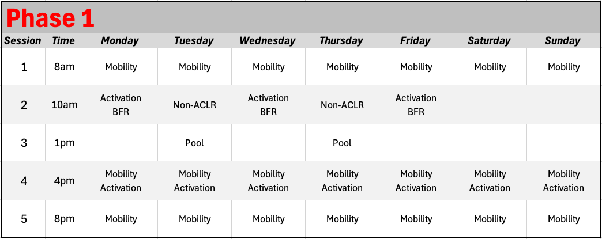

```{r setup-root, include=FALSE}
knitr::opts_knit$set(root.dir = normalizePath("../.."))
```

```{r}
source("Global.R")
source("plot_functions.R")
source("Themes.R")
```

The first phase of ACL rehabilitation begins immediately following surgery. The body will require a period of rest and recovery, along with some targeted recovery interventions such as the use of crutches, icing and elevation. It is important to remember that every injury and every surgery are different, but in many cases, Phase 1 must involve much more than just passive recovery. The key will be to strike a balance among passive and active interventions and to consistently work towards satisfying a few targeted criteria in order to prepare the knee for more intense progressions in the coming phases.

::: {.callout-important title="Most Important Goals — Phase 1"}
- Reduce pain and swelling
- Regain range of motion: Get the knee straight!
- Re-establish normal gait
- Re-establish control of the quadriceps muscles
:::

The goal of this Phase 1 protocol is to support both athlete and practitioner in striking the optimal balance between recovery, strength and mobility while being guided by these goals. **`r params$athlete`'s** progress towards these goals will be assessed via the criteria seen below. Detailed description of each criteria and the associated testing methodology can be found in @sec-p1-testing.

```{r}
#Create the table
tbl_phase1 <- criteria_phase1 %>%
  transmute(
    `Outcome Measure` = outcome_measure,
    `Op` = operator_pretty,
    Goal              = goal_pretty,
    Score             = score,
    meets
  ) %>%
  gt() %>%
  tab_header(title = md("**Phase 1 Criteria**")) %>%
  fmt_number(
    columns = Score,
    decimals = 0
  ) %>%
  sub_missing(columns = Score, missing_text = "") %>%
  cols_label(Op = "") %>%
  cols_width(`Outcome Measure` ~ px(360)) %>%
  cols_align(align = "center", columns = c(Goal, Score)) %>%
  cols_align(align = "right",  columns = Op) %>%
  tab_style(
    style = list(cell_fill(color = "#E8F5E9"),
                 cell_text(color = "#1B5E20", weight = "600")),
    locations = cells_body(columns = Score, rows = meets %in% TRUE)
  ) %>%
  tab_style(
    style = list(cell_fill(color = "#FFF9C4"),
                 cell_text(color = "#7A6A00", weight = "600")),
    locations = cells_body(columns = Score, rows = meets %in% FALSE)
  )  %>%
  cols_hide(meets) %>%
  ak_gt_theme3() %>%
  tab_options(
    table_body.hlines.style = "solid",
    table_body.hlines.width = px(1),
    data_row.padding = px(6)
  )

tbl_phase1
```

```{r}


# By default: denominator = all criteria (matches your table showing blank scores)
met_n_all   <- sum(criteria_phase1$meets %in% TRUE, na.rm = TRUE)
total_n_all <- nrow(criteria_phase1)

goals_progress_bar(met_n_all, total_n_all)

```

```{=html}
<div class="break-logo">
  
</div>
```

## What does the research say? {#sec-p1-research}

High-quality early-stage rehab is crucial for overcoming major aspects of dysfunction associated with ACL injury/repair and developing key qualities that will be required to succeed as the rehab progresses @buckthorpe2024. The criteria chosen for phase 1 of this protocol have been selected based on the latest available research and are robustly agreed upon by researchers and practitioners. This section will explore each of these criteria directly. The aim is to provide a detailed understanding of why each of these criteria were included, and what the research says about how to most effectively progress each one.

### Pain and Swelling

Pain and swelling are two signs of inflammation that are to be expected following ACLR, and must be managed appropriately in order to improve both acute and long-term outcomes @lattermann2017. Pain and swelling are known to affect join proprioception @hurley1997, to increase arthrogenic muscular inhibition (AMI) [@lepley2021; @norte2021] , and to mechanically prevent full joint ROM. This means that the pain and swelling that exists following surgery will prevent the athlete from being able to fully flex/extend their knee, will reduce the ability to contract the muscles, and will cause decreased awareness of body/joint position, movement and force production @riemann2002.

Agreed upon interventions for addressing pain and swelling in this phase include the use of cryotherapy (ice), compression and elevation @buckthorpe2024. Cryotherapy during the first 3 days following surgery has been shown to decrease pain, and reduce medication use @kotsifaki2023. Compressive cryotherapy, for example, with the use of a GameReady device , if available, may be more effective at reducing pain and also may have a small effect on swelling reduction in comparison to cryotherapy alone. Active ROM tasks, discussed in the following section might also lead to decreased pain and swelling due to increased venous blood return @buckthorpe2024.

In order to effectively progress, it is important to monitor both pain and swelling. Monitoring of pain can be a difficult task, given that it is subjective and highly unique to each individual, however standardization of assessment can improve consistency. The daily wellness questionnaire included with the CSI Pacific ACL Rehab Guide uses an 11-point numeric rating scale from 0 (absence of pain) to 10 (worst pain imaginable). The single easiest step to maintain consistency and reliability would be to complete the questionnaire at a consistent time of day: either first thing in the morning or immediately at the start of rehab sessions. Given the subjective nature of pain, knee pain score has not been included as an official criteria for progression from Phase 1 to Phase 2, although monitoring of pain throughout the rehab is crucial. Practitioners may wish to include pain as a criteria in some cases, and if so, a rating of \<2/10 has been recommended as a criterion for clearing phase 1 [@buckthorpe2020]. Swelling should also be monitored regularly, especially during Phase 1 of rehabilitation. The Stroke test has been included in Phase 1 Criteria given that it has been shown to be a reliable indicator of swelling @sturgill2009. A detailed description of this test can be found in the @sec-p1-testing section. Knee circumference measurements are another simple tool that we recommend, given that it is a simple test for the patient to implement on their own. In a seated position with the knee in full extension, the patient measures the circumference of the knee, 1cm proximal to the superior pole of the patella @jakobsen2010. Changes exceeding 1cm can be regarded as a clinically significant indicator of joint stress. When sustained increases in swelling and soreness occur, it is important to consider load management strategies. Effective communication between the patient and practitioner can help to determine the causes which could be related to workload in the gym/clinic, activities outside the clinic or sub-optimal use of recovery interventions.

### Knee Mobility

Recovery of extension and flexion ROM are crucial during early stage rehabilitation. Deficits during this phase are strongly related to mid- and late-stage ACL rehab ROM deficits @noll2015, highlighting the need to address these criteria early, before the effects can snowball. Adequate ROM is clearly important when performing higher intensity exercises later on in rehab, but it's also important in the short term as sufficient knee extension is important for re-establishing normal gait (another Phase 1 criteria) @shelbourne2009. Knee extension deficits are also predictive of other pathologies, such as anterior knee pain which can be five times more likely to occur in patients lacking extension @marques2020.

Adequate knee flexion should also be achieved during this stage, and should be progressive and not aggressive @buckthorpe2024. In other words, flexion should not be forced and practitioners may need to take extra care and exercise patience in certain cases. It should be noted that knee flexion ROM may also be highly dependent on associated injuries or surgical procedures. For example, a meniscus injury associated with an ACL tear may lead to restrictions on knee flexion ROM in early rehab. Overall, practitioners and patients alike should understand that early mobilization, beginning immediately after surgery can improve knee flexion and extension ROM without compromising joint laxity, regardless of graft type @kotsifaki2023. As will be seen in the training program, both passive and active ROM exercises are essential in this phase.

### Muscle Activation

Weakness of the knee extensor muscles following surgery is associated with altered biomechanics during gait and other functional tasks, decreased dynamic stability, persistent knee pain, increased risk of osteoarthritis and poorer RTS outcomes @buckthorpe2024. The greater the deficits in strength at the end of Phase 1, the more difficult it will be to recover strength during later phases. Clearly, restoring the patients ability to contract their leg muscles is crucial, however care must be taken at this phase given the likelihood of existing and reactive pain/swelling, as well as ROM deficits. Therefore, this protocol will aim to begin low-level "strength" exercises as early as possible following ACLR by incorporating thoughtful exercise progressions with careful symptom monitoring.

Muscle activation strategies at this stage will aim to minimize strength loss stemming from neural inhibition and muscle atrophy, but also must consider acute factors such as AMI, graft healing and patellofemoral joint (PFJ) stress. AMI, mentioned above as a consequence of pain and swelling, occurs when uninjured muscle becomes reflexively inhibited in response to a joint injury [@hopkins2000]. The practitioner must consider that in limiting neuromuscular activation, which is required to bring about improvements in quadriceps function in response to resistance training, the presence of AMI limits the value of strength training and again points to the need for thoughtful exercise programming @buckthorpe2024. Graft healing is another important consideration and it is crucial to understand how different exercises might load the graft itself, allowing for appropriate task and load selection to protect the graft from excessive forces which could lead to compromise or failure [@escamilla2012; @grodski2008]. Following ACLR the graft fixation sites require time for incorporation into the bone and the graft itself is vulnerable to fixation loosening and stretching if excessive tensile forces are applied @claes2011. Lastly, patellofemoral pain (PFP) syndrome is common following ACLR @culvenor2016 , and thus exercise and load selection must progress PFJ loading appropriately.

Given all of these considerations, how can we actually load the knee to improve muscle activation and strength? For simplicity, programming decisions can be broken down into exercise selection, load/intensity, and volume/frequency. Early stage exercise selection for enhancing muscle activation should focus on isolated tasks including both closed kinetic chain (CKC; e.g. quarter squat) and open kinetic chain (OKC; straight leg raises). Functional exercises (e.g. squats/deadlifts) may be included for the purposes of reintroducing motor patterns, but the considerable AMI likely to be present during this phase will lead to altered technique and sub-optimal neural and morphological adaptations @buckthorpe2024. It is important to note that low load OKC leg extensions are considered safe for the knee following ACLR and may even be considered a critical inclusion in the training program @noehren2020. Research has shown no evidence of anterior tibial laxity following OKC versus CKC exercise @perriman2018 and ACL strain during walking is known to be higher than during full ROM low-load leg extensions @escamilla2012. Still, care must still be taken in the programming of OKC, and these should not begin until patients have minimal pain (0-2), minimal swelling (\< 1) and no lag on straight leg raise. Thus in the CSI Pacific program, OKC leg extensions are introduced only once all Phase 1 criteria have been met.

In general, lower loads/intensities are recommended at this stage of rehab. In the CSI Pacific Program, loads during this phase will mostly lie within the range of 10-20 repetition maximum (RM) with greater proximity to technical failure being a key variable of progressive overload. At these lower loads, volume/frequency must be relatively high in order to achieve desired neuromuscular adaptations. The frequency of training may be increased during this phase, and may even include multiple sessions per day. Session volume may also increase as function improves. The rehabilitation program must also include full body strength training with specific attention in the early phase towards the plantar flexor muscles and non-weight bearing hip and core strengthening exercises.

Lastly, given the difficulties associated with improving muscle activation in early phase ACL rehab, research in recent years has increasingly focused on the inclusion of supplementary strategies designed to allow for mechanical loading and neuromuscular activation without placing excess stress on the graft or PFJ. In the case where these supplementary strategies are robustly supported by research, and involve tools that are available to us at CSI Pacific, they may or may not be included as part of each individual rehabilitation. These include Phase 1 specific recommendations for the use of neuromuscular electrical stimulation (NMES), passive and/or active blood flow restriction (BFR) hydrotherapy, and isometric training. More information and a deeper dive into the research supporting each of the tools are highlighted in @sec-pi-add-resources.

### Re-Establishing Normal Gait

The importance of re-establishing movement patterns such as walking has been established by research showing that knee movement and loading asymmetries seen during gait at 4 weeks post-ACLR tend to persist at 4 months @sigward2016. Each of the above factors (pain, swelling, limited ROM/muscle activation) is certain to affect movement quality following ACLR. Interestingly, alongside the biomechanical and neuromuscular deficits brought on by these factors, recent research has begun to examine the neurophysiological effects of ACL injury on sensorimotor control. Following ACL injury, the loss of mechanoreceptors from the ligament results in a decrease in components of proprioception such as joint position sense and kinaesthesia, which in turn result in neuroplasticity affecting the processes by which an individual controls movement @grooms2017. These neuroplastic alterations, often studied by examining brain activity during exercise, are known to be persistent and often unresolved for long periods of time following ACLR @grooms2015. The bottom line is that we cannot simply expect gait and other movement patterns to return to normal once other factors like pain, swelling, mobility and activation have begun to improve. It is important to specifically target movement re-training as a part of ACLR rehab and to initiate this aspect of the program as early as possible post-ACLR @buckthorpe2021.

Targeted movement retraining exercises are built directly into all CSI Pacific ACL Rehab programs. Many protocols use "normal gait" as an exit criteria for early rehabilitation, however given the difficulty of assessing and quantifying "normal" for each individual, we have decided to make this a key focus of the protocol, but not an objective criteria for progression. Targeted movement interventions found in the ACL Rehab Programs are based on motor learning principles, specifically applied to movement re-training post-ACLR @gokeler2019. During phase 1 you can expect exercises focusing on dynamic control and stability, especially at the knee and hip joints. The protocol will also make use of aquatic therapy (if available to the patient) to introduce functional tasks in a de-loaded environment [@buckthorpe2019].

```{=html}
<div class="break-logo">
  
</div>
```

## Testing {#sec-p1-testing}

Each card below contains a detailed description of the tests to be conducted during this phase of rehab.

```{r, echo=FALSE, results='asis'}


tests <- criteria_phase1 |>
  dplyr::select(outcome_measure, display_description, additional_information, operator_pretty, goal_pretty, repetitions, calculation, image_path) %>%
  mutate(op_goal = paste(operator_pretty, goal_pretty))

# Helper: print a label/value line only if value is non-missing & non-empty
emit_field <- function(label, value) {
  if (length(value) == 0 || all(is.na(value))) return(invisible())
  val <- value[[1]]
  if (is.na(val)) return(invisible())
  val_chr <- trimws(as.character(val))
  if (!nzchar(val_chr)) return(invisible())
  cat("**", label, ":** ", val_chr, "\n\n", sep = "")
}

for (i in seq_len(nrow(tests))) {
  cat('::: {.card .ak-card .has-stripe .accent-primary}\n')

  # Use columns instead of layout-columns
  cat('::: {.columns}\n')

  # ---- LEFT: TEXT ----
  cat('::: {.column width="70%"}\n')

  cat('### ', tests$outcome_measure[i], '\n\n', sep = '')

  if (!is.na(tests$display_description[i]) &&
      nzchar(trimws(tests$display_description[i]))) {
    cat(tests$display_description[i], '\n\n')
  }

  cat("*", tests$additional_information[i], '\n\n')

  emit_field("Criteria", tests$op_goal[i])
  emit_field("Repetitions", tests$repetitions[i])
  emit_field("Calculation", tests$calculation[i])

  cat(':::\n')  # end text column

  # ---- RIGHT: IMAGE ----
  cat('::: {.column width="30%"}\n')
  if (!is.na(tests$image_path[i]) && nzchar(trimws(tests$image_path[i]))) {
    cat('{style="width:100%;"}\n', sep = '')
  }
  cat(':::\n')  # end image column

  cat(':::\n')  # end columns
  cat(':::\n\n')  # end card
}


```

```{=html}
<div class="break-logo">
  
</div>
```

## The Program

Below you will find links to your training programs.

[Phase 1: Program 1](https://www.teambuildr.com/)

@fig-1 shows an example weekly schedule for this phase of the rehabilitation. Although it appears very time intensive, sessions 1, 4 and 5 can be done at home and on a flexible schedule.

{#fig-1 .lightbox}

When considering changes or further individualization of the program, and to see how these exercises compare to other phases of the rehab, please see the **Exercise Phase Chart** in the book resources. All exercise programming should be done by a CSI Pacific S&C Coach or a physiotherapist.

These programs have been designed by S&C coaches with many years of experience leading ACL rehabilitations. The programs are also evidence-informed and represent the product of study, translation, and implementation to bridge the gap between research and practice.

```{=html}
<div class="break-logo">
  
</div>
```

## Additional Resources {#sec-pi-add-resources}

### Whole Body Fitness and Function

Successful ACL rehab, particularly when the aim is to return to high-performance sport, requires physical preparation beyond just the site of the injury. Maintenance or restoration of total body neuromuscular function, cardiovascular fitness, and sport-specific movement quality will be of high importance when the time comes for a return to sport and performance. However, a crucial aspect of early-stage fitness development is acknowledging that this is not the main priority and that it must not compromise recovery from surgery @buckthorpe2024 . Therefore, during Phase 1, the CSI Pacific ACL protocol will gradually and carefully introduce training that focuses on the rest of the body other than the site of injury, and only if all Phase 1 criteria are progressing to the satisfaction of the lead practitioner. Training elements to potentially introduce at this phase include: non-weight bearing cardiovascular conditioning, upper body/core exercises, and contralateral limb strengthening.

### Aquatic Therapy

Aquatic therapy is a useful tool throughout ACL rehab but provides some specific advantages during early-phase rehabilitation. In many cases, the athlete will be safe to enter the water once the wounds from surgery have sufficiently healed, any stitches have been removed, and scars are free from signs of inflammation @buckthorpe2019. The expected timeline for entering the water is 2-3 weeks post-ACLR, but this will vary for every individual. Given this expected timeline, aquatic therapy is likely to begin during late Phase 1 or early Phase 2 intervention, and the benefits and recommendations discussed here will focus on this time period.

The primary benefit at this stage is the opportunity to accelerate the recovery of gait and other movement patterns by utilizing the buoyancy of water to reduce the effect of gravity and thus reduce joint loading. To state the obvious, the more the athlete's body is immersed in water, the greater the effect of buoyancy and the more body weight is offloaded. In general, being submersed to the symphysis pubis (just below the waist) will offload 40% of body weight increasing to 50% at the umbilicus and \~60% at the Xiphoid process @buckthorpe2019. These rules-of-thumb allow us to train specific movement patterns at specific proportions of body weight and also allow for clear progression and re-loading over time. Exercises included in the Phase 1 Aquatic Therapy program will primarily focus on componenets of gait performed in deep water, progressing to shallower water as the patient enters Phase 2.

Aquatic therapy may have some additional benefits at this stage of rehab including reduced swelling due to hydrostatic pressure forcing fluid out of the joint and supporting optimized venous return and lymphatic drainage @buckthorpe2019. Other benefits such as maintenance/development of cardiovascular fitness and re-introduction of plyometrics will be covered in later chapters.

### Neuromuscular Electrical Stimulation

The inclusion of NMES in addition to foundational exercise interventions may help to improve quadriceps strength in early-stage ACL Rehab @kotsifaki2023. The use of NMES in the early days and weeks following surgery is of interest to researchers and practitioners because this is the period of time where AMI is likely to be highest. NMES works by directly activating the motor axon and thus directly recruiting the inhibited motor neurons @li2025. In this way, NMES is thought capable of overcoming the expected deficits in voluntary muscle activation post-ACLR.

A recent systematic review/meta analysis included eleven studies with NMES start dates ranging from 72hrs to 3 weeks post-ACLR @li2025. Of these eleven studies, five of them introduced NMES within the first week post-ACLR. Sub-group analysis showed that NMES enhanced quadriceps strength recovery regardless of intervention start time, but that an intervention time of ≤ 1 week was more effective than interventions starting after 1 week post-ACLR. The studies referenced here all support the use of NMES during early stage ACL rehab, and provide information towards programming and planning the use of NMES either as a passive intervention or in combination with movement/voluntary muscle contractions [@toth2020; @hasegawa2011; @feil2011; @paternostro-sluga1999; @taradaj2013].

As in the Pre-op Phase, although the research tends to support the inclusion of NMES in Phase 1 rehabilitation, we must examine it's inclusion from a practical perspective. If NMES is available, it may be included in any ACL rehab, but at this time it is not considered an absolutely essential intervention, and it should only be used as an addition when the fundamentals of Phase 1 rehab are being adhered too sufficiently.

### Blood Flow Restriction

BFR shows some promise as a tool for maintaining muscle mass and improving patient-reported outcomes following ACL reconstruction, but the research is not unanimous about it's use during early stage ACL rehabilitation @charles2020. Surprisingly, there appear to be very few randomized control trials that have specifically examined the use of BFR during ACL rehab, however a quick search revealed *five* different systematic reviews on the topic [@lipker2019; @charles2020; @lu2020; @gopinatth2025; @ruoyi2025]. A detailed overview of these reviews can be found in the [BFR]{.underline} chapter located in the Resources section of this book.

Regarding phase 1 specifically, studies have explored the effect of BFR introduced as early as day 2 post-ACLR [@takarada2000; @iversen2016] . Both of these studies ended their interventions after 14 days, providing specific insight into the use of BFR during this early stage. Both studies employed twice daily sessions of 5 repetitions of 5 minutes of complete vascular occlusion, with 3 minutes of reperfusion, while the subject lay supine. Interestingly, in the first study, patients remained passive during occlusion @takarada2000, while in the second study patients performed quadriceps exercises consisting of isometric contractions, progressing to leg extension over a knee-roll, and straight leg raises @iversen2016. In the first study, MRI results taken immediately after the 2 week intervention showed significantly less decrease of thigh muscle cross-sectional area (CSA) compared to a control group, supporting the use of passive BFR for maintaining muscle mass @takarada2000. Interestingly, in the second study, there was no difference in CSA decrease between the BFR group and the group that performed the quadriceps exercises without BFR @iversen2016. Taken together, these results suggest that BFR during Phase 1 ACL rehab may attenuate muscle atrophy in comparison to performing no quadriceps activation exercise, but may not be more effective than performing the activation exercises on their own.

Other studies have started BFR within time-frames associated with Phase 1 ACL rehab, and provide further precedence for the use of BFR in the early stages [i.e. @ohta2003]. However, given the nature of these studies, they do not allow firm conclusions to be drawn about optimal initiation or sequencing of BFR use. These longer term studies will be discussed in more detail in subsequent chapters.

Overall, there is some evidence supporting the use of BFR in Phase 1 ACL rehabilitation, though the literature is still evolving. BFR in general is well-studied and it's ability to mitigate muscle atrophy in the absence of heavy loads is well established. Therefore, practitioners may choose to safely integrate BFR into the rehab program during Phase 1. These recommendations will be updated as new research is released.

```{=html}

<div class="break-logo">
  
</div>
```

## Notes and Considerations for Reviewers

All feedback is welcome, however here are some considerations that should help inform the development of this chapter.

- As an experienced practitioner who would be using this tool to lead a rehab: after reading this chapter, and familiarizing yourself with the program, the data collection tools, and the dashboards.. does it all align and fit together in a way that will help you take the lead on a rehab?
- I would like a PS2 S&C practitioner to be able to read this chapter and feel comfortable that they understand the theory behind the program that they are implementing. Have I achieved this goal?
