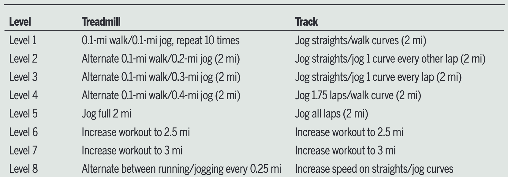
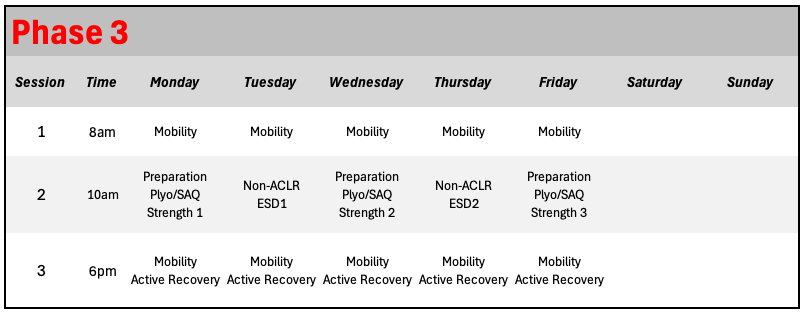

```{r setup-root, include=FALSE}
knitr::opts_knit$set(root.dir = normalizePath("../.."))
```

```{r}
source("Global.R")
source("plot_functions.R")
source("Themes.R")
```

Upon completing phase 2 the athlete has developed adequate strength and neuromuscular control to begin building capacity to perform more dynamic tasks such as jumping, landing, running, agility, and change of direction. Development of muscular strength and neuromuscular control will continue to progress with the objective now to meet or exceed pre-injury values.

::: {.callout-important title="Most Important Goals — Phase 3"}
- Muscular Strength Returns towards pre-injury values
- Develop quality jumping/hopping/landing performance while progressing intensity and capacity
- Demonstrate movement competence and confidence in agility and change of direction exercises
:::

**`r params$athlete`'s** progress towards these goals will be assessed via the criteria seen below. Detailed description of each criteria and the associated testing methodology can be found in the [Testing](#sec-p3-testing) section.

```{r}
#Create the table
tbl_phase3 <- criteria_phase3_abr %>%
  transmute(
    `Outcome Measure` = outcome_measure,
    `Op` = operator_pretty,
    Goal              = goal_pretty,   # nice display string from your sheet
    Score             = score,
    meets
  ) %>%
  gt() %>%
  tab_header(title = md("**Phase 3 Criteria**")) %>%
  fmt_number(
    columns = Score,
    decimals = 0
  ) %>%
  fmt_number(
    columns = Score,
    rows = `Outcome Measure` %in% percent_label,
    decimals = 0,
    pattern = "{x}%"
    ) %>%
  sub_missing(columns = Score, missing_text = "") %>%
  cols_label(Op = "") %>%
  cols_width(`Outcome Measure` ~ px(360)) %>%
  cols_align(align = "center", columns = c(Goal, Score)) %>%
  cols_align(align = "right",  columns = Op) %>%
  tab_style(
    style = list(cell_fill(color = "#E8F5E9"),
                 cell_text(color = "#1B5E20", weight = "600")),
    locations = cells_body(columns = Score, rows = meets %in% TRUE)
  ) %>%
  tab_style(
    style = list(cell_fill(color = "#FFF9C4"),
                 cell_text(color = "#7A6A00", weight = "600")),
    locations = cells_body(columns = Score, rows = meets %in% FALSE)
  )  %>%
  cols_hide(meets) %>%
  ak_gt_theme3() %>%
  tab_options(
    table_body.hlines.style = "solid",
    table_body.hlines.width = px(1),
    data_row.padding = px(6)
  )

tbl_phase3
```

```{r}

goals_progress_bar <- function(
    met, total,
    label = "Goals met",
    width = "100%",
    accent = "#D71920",   # table accent (red)
    border = "#A7A9AC",   # table border grey
    track_bg = "#FCFCFC", # header/stripe light bg
    fill_from = "#2E7D32",# green gradient start
    fill_to   = "#4CAF50" # green gradient end
) {
  pct <- if (total > 0) round(100 * met / total) else 0
  
  tagList(
    tags$style(HTML(sprintf("
      .ak-pb-wrap   { margin-top:12px; font-family:'Open Sans',system-ui,-apple-system,Segoe UI,Roboto,Arial,sans-serif; }
      .ak-pb-meta   { display:flex; justify-content:space-between; font-size:0.95rem; margin-bottom:6px; color:#222; }
      .ak-pb-meta strong{ color:%s; font-weight:700; } /* accent like table title */
      .ak-pb       { background:%s; border:1px solid %s; border-radius:10px; height:14px; overflow:hidden; }
      .ak-pb__fill { height:100%%; background:linear-gradient(90deg,%s,%s); transition:width .3s ease; }
    ", accent, track_bg, border, fill_from, fill_to))),
    div(class = "ak-pb-wrap",
        div(class = "ak-pb-meta",
            tags$strong(sprintf("%s: %d/%d", label, met, total)),
            span(sprintf("%d%%", pct))
        ),
        div(
          class = "ak-pb",
          role = "progressbar",
          `aria-valuemin` = "0",
          `aria-valuemax` = "100",
          `aria-valuenow` = pct,
          style = sprintf("width:%s;", width),
          div(class = "ak-pb__fill", style = sprintf("width:%d%%;", pct))
        )
    )
  )
}


# By default: denominator = all criteria (matches your table showing blank scores)
met_n_all   <- sum(criteria_phase3_abr$meets %in% TRUE, na.rm = TRUE)
total_n_all <- nrow(criteria_phase3_abr)

goals_progress_bar(met_n_all, total_n_all)

```

```{=html}
<div class="break-logo">
  
</div>
```

## What does the research say? {#preop-outcomes}

After achieving sufficient basic neuromuscular function, a period of additional advanced neuromuscular training must begin in order to restore dynamic and explosive neuromuscular performance [@buckthorpe2019a]. This advanced training will involve research-backed progressions of movements that are key during sports such as jumping, hopping, landing, running, agility, and change of direction. These progressions will be guided by criteria targeting **outcomes relying on rapid force development** such as maximal jump height or hop distance, as well as **movement quality** assessed both objectively and subjectively by IST practitioners.

------------------------------------------------------------------------

#### Jumping, Hopping, and Landing

The reintegration of dynamic tasks such as jumping and landing in order to re-develop neuromuscular performance and movement quality, while respecting tissue healing, is an important piece of ACL rehab and is known to positively affect functional outcomes [@buckthorpe2021a]. The Aspetar clinical practice guideline published by Kotsifaki et al. @kotsifaki2023a included evidence from four randomized clinical trials (RCTs) comparing plyometric, agility, and sport-specific exercises to "usual" rehabilitation protocols. Two studies reported significant improvements in knee function at 6 months @risberg2007 and at 1 & 2 years @risberg2009 following ACLR in participants who performed a 6-month neuromuscular exercise program, in comparison to a standard muscle strengthening program. One study demonstrated that an 8-week (4-6 months post-ACLR) functional training program which emphasized plyometrics and agility, in comparison to a control program, led to improved performance on a number of hop/jump tests @souissi2011. Another compared 6-weeks of plyometric, eccentric, and combined training and found that combined training was the most effective for improving functional and psycho-social outcomes @kasmi2021, providing strong evidence for vertical integration @mujika2018 during mid-to-late phase ACL rehabilitation. Overall, the literature supports the inclusion of plyometric training to improve subjective function and functional activities.

When programming and implementing these types of exercises, the practitioner must understand the specific loading demands of the various tasks and the athlete's capacity to tolerate these loading demands. The integration of jumping, hopping and landing into the rehab, aligned with the ACL functional recovery process is guided by the four stage plyometric progression model proposed by Buckthorpe and Della Villa @buckthorpe2021a. This program, outlined in @fig-1 considers the task and it's associated intensity and complexity, the required movement quality and strength to perform the tasks and specific monitoring of responses and criteria.

Progression through the program can be described in terms of:

1.  Bilateral -\> Unilateral

2.  Increasing intensity and specificity

3.  Increasing entry velocity

4.  Decreasing ground contact time (GCT)

5.  Linear (vertical -\> horizontal -\> lateral) —\> Multi-planar tasks

6.  Compliant surfaces -\> Stiff surfaces

{#fig-1 .lightbox}

The entry criteria for stage 1 of this framework would be satisfied if the athlete has met Phase 2 criteria of the CSI Pacific ACL protocol. It is possible that stage 1 jumping/landing progressions could be introduced prior to full completion of Phase 2 criteria (i.e. isometric knee extension LSI \> 70% but \< 75%), and this may be considered by practitioners on a case-by-case basis, with a conservative approach being the default recommendation. These criteria are crucial for determining the introduction of dynamic exercises, as the athlete is likely to exhibit persistent knee extensor weakness which could result in biomechanical compensatory strategies @palmieri-smith2015. At roughly 3 months post surgery, it can be expected that athletes may off-load the knee joint during squatting exercise by over-loading the un-affected side (inter-limb) or using a hip-dominant strategy (intra-limb) @sigward2018. Furthermore these compensation strategies have been demonstrated to persist until 5 months post-ACLR, highlighting the importance of a gradual introduction of more dynamic movements and on thoughtful task selection in order to develop optimal motor patterning @wolpert2011.

Stage 2 and 3 plyometric progressions fit well within Phase 3 of the current protocol, as we seek to develop bilateral power, unilateral eccentric control, and neuromuscular function during more dynamic tasks. Stage 4 of the plyometric progressions will be discussed in more depth in the Phase 4: RTS chapter of this protocol

### Running

At this stage of the rehab, it is likely that the athlete will meet criteria to begin a progressive return to running (RTR). This is a key element in the RTS/RTP journey @ardern2016 and an important aspect of the transition from impairment-focused tasks of early-phase rehab to the dynamic, functional tasks of late-phase rehab @rambaud2018. The RTR decision is an important one, since a pre-mature introduction of running can increase the risk of re-injury @kyritsis2016, while delayed progress may hinder motivation and psychological readiness to RTS @ardern2013.

The best evidence available to aid in the return-to-run decision comes from a 2018 scoping review which extracted data from 201 studies, each reporting at least one criterion for permitting adult patients to commence running post-ACLR @rambaud2018. Unsurprisingly, the most commonly reported criterion was time since surgery, with the median time of RTR being 12 weeks post-op (IQR = 3.3, range = 5-39 weeks) with RTR being defined as running at slow speeds (8-10 km/h). The interquartile range of 3.3 gives us a rough idea that during a typical rehabilitation, an athlete can expect to RTR somewhere within 9-15 weeks post-op. Interestingly, only 18% of studies (36 / 201) reported clinical, strength or performance-based criteria for RTR. The most frequently reported criteria were: full knee range of motion, pain \<2 on a visual analogue scale, isometric quadriceps LSI \> 70% and hop test LSI \> 70%. A settled, asymptomatic knee (full ROM, no pain, no swelling) should be considered non-negotiable prior to allowing any form of running. The capacity of the knee to tolerate loading is also crucial, but with more nuance as to the exact definition of criteria.

> "We suggest that these clinical criteria: pain \<2 on a visual analogue scale, 95% knee flexion ROM, 0º knee extension ROM, no effusion/swelling, should be used as 'non-negotiable' clinical milestones for RTR" @rambaud2018

Some studies have suggested that jogging on the treadmill can be commenced once knee extensor LSI reaches \> 70% [@buckthorpe2020; @buckthorpe2020a] while others suggest \> 80% @adams2012. Given the lack of conclusive results at this time, our recommendation is that 70% LSI be the criteria for introducing very low intensity running drills, while 80% LSI is required in order to begin running at a volume and intensity which could achieve cardiovascular adaptation @kotsifaki2023a. This allows for a continuous and careful progression of volume, intensity and complexity of movement.

{#fig-2 .lightbox}

@fig-2 shows an example of a RTR progression @adams2012, with options for treadmill or track based progression, which was used to inform the CSI Pacific RTR program. In this framework, progression from one level to the next occurs when the athlete is able to complete the assigned activity with no increase in effusion or pain. Weekly progression is capped at a maximum of 2 levels and at least 48 hours of recovery should be allowed between each running workout.

Ultimately, in order to RTR, the athlete must satisfy the following criteria:

```{r}
#Create the table
tbl_rtr <- criteria_rtr_abr %>%
  transmute(
    `Outcome Measure` = outcome_measure,
    `Op` = operator_pretty,
    Goal              = goal_pretty,   # nice display string from your sheet
    Score             = score,
    meets
  ) %>%
  gt() %>%
  tab_header(title = md("**RTR Criteria**")) %>%
  fmt_number(
    columns = Score,
    decimals = 0
  ) %>%
  fmt_number(
    columns = Score,
    rows = `Outcome Measure` %in% percent_label,
    decimals = 0,
    pattern = "{x}%"
    ) %>%
  sub_missing(columns = Score, missing_text = "") %>%
  cols_label(Op = "") %>%
  cols_width(`Outcome Measure` ~ px(360)) %>%
  cols_align(align = "center", columns = c(Goal, Score)) %>%
  cols_align(align = "right",  columns = Op) %>%
  tab_style(
    style = list(cell_fill(color = "#E8F5E9"),
                 cell_text(color = "#1B5E20", weight = "600")),
    locations = cells_body(columns = Score, rows = meets %in% TRUE)
  ) %>%
  tab_style(
    style = list(cell_fill(color = "#FFF9C4"),
                 cell_text(color = "#7A6A00", weight = "600")),
    locations = cells_body(columns = Score, rows = meets %in% FALSE)
  )  %>%
  cols_hide(meets) %>%
  ak_gt_theme3() %>%
  tab_options(
    table_body.hlines.style = "solid",
    table_body.hlines.width = px(1),
    data_row.padding = px(6)
  )

tbl_rtr
```

```{r}

# By default: denominator = all criteria (matches your table showing blank scores)
met_n_all   <- sum(criteria_rtr_abr$meets %in% TRUE, na.rm = TRUE)
total_n_all <- nrow(criteria_rtr_abr)

goals_progress_bar(met_n_all, total_n_all)
```

```{=html}
<div class="break-logo">
  
</div>
```

### Agility and Change of Direction

Multi-directional dynamic movements that require the ability to accelerate, decelerate and change direction are an important focus of Phase 3 rehab, which must be observed distinctly from simple forward running. COD manoeuvres such as cutting and pivoting are associated with ACL loading and injury risk due to the large multiplanar forces generated at the knee joint during these movements @dossantos2019. Despite this importance, fewer than one in eight studies included in a 2025 scoping review included any formal assessment of COD or agility, with most ACLR protocols continuing to rely almost exclusively on strength and single-leg hop performance @wright2025. Additionally, while direct evidence for specific COD training interventions in ACLR populations remains limited, the framework for progression is supported by biomechanical research in athletic populations @dossantos2019 and expert clinical consensus [@buckthorpe2020a; @taberner2019].

In Phase 3, athletes are introduced to controlled acceleration and deceleration mechanics, lateral movement patterns, and reactive quickness tasks in a predictable, lower-stakes environment. Based on the ten task-based progression provided by Buckthorpe et al @buckthorpe2020a, this controlled introduction of COD work will occur later in Phase 3, once the athlete has demonstrated some proficiency in forward running, unilateral landing/deceleration and unilateral plyometrics. Exercises will begin with simple movements and short angle changes to limit the loading on the knee. COD movements will initially be performed slowly (i.e. with lower approach speeds) thus reducing body momentum and deceleration demand. A scoping review of 22 intervention studies found that balance training and COD technique modification, focusing on reducing lateral trunk lean, narrowing foot plant distance, and increasing knee flexion at ground contact were the most effective gym-based strategies for reducing hazardous knee joint loading during directional changes, producing small-to-moderate effect sizes @dossantos2019. Notably, resistance training alone and generic agility drills performed without coach feedback did not reduce COD-related knee joint loads, underscoring the importance of monitoring and correcting movement quality at this stage. Ultimately, the emphasis on controlled COD with high quality, symmetrical movement will build the neuromuscular foundation for more sport-specific, field-based training in Phases 4 and 5.

```{=html}
<div class="break-logo">
  
</div>
```

## Testing {#sec-p3-testing}

Each card below contains a detailed description of the tests to be conducted during this phase of rehab.

```{r, echo=FALSE, results='asis'}


tests <- criteria_phase3 |>
  dplyr::select(outcome_measure, display_description, additional_information, operator_pretty, goal_pretty, repetitions, calculation, image_path) %>%
  mutate(op_goal = paste(operator_pretty, goal_pretty)) %>%
    filter(!outcome_measure %in% c(
    "Y-Balance (Anterior)",
    "Y-Balance (Postero-Medial)",
    "Y-Balance (Postero-Lateral)",
    "CMJ Height",
    "CMJ Lengthening Asymmetry",
    "CMJ Shortening Asymmetry",
    "Drop and Stick - TTS",
    "Drop and Stick - Landing Force",
    "Drop and Stick - Asymmetry"
  ))

# Helper: print a label/value line only if value is non-missing & non-empty
emit_field <- function(label, value) {
  if (length(value) == 0 || all(is.na(value))) return(invisible())
  val <- value[[1]]
  if (is.na(val)) return(invisible())
  val_chr <- trimws(as.character(val))
  if (!nzchar(val_chr)) return(invisible())
  cat("**", label, ":** ", val_chr, "\n\n", sep = "")
}

for (i in seq_len(nrow(tests))) {

  cat('::: {.card .ak-card .has-stripe .accent-primary}\n')

  # ---- TITLE ----
  cat('### ', tests$outcome_measure[i], '\n\n', sep = '')

  # ---- FULL-WIDTH TEXT ----
  if (!is.na(tests$display_description[i]) &&
      nzchar(trimws(tests$display_description[i]))) {
    cat(tests$display_description[i], '\n\n')
  }

  cat("*", tests$additional_information[i], '\n\n')

# ---- BOTTOM ROW (FLEX) ----
cat('<div style="display:flex; gap:1.5rem; align-items:center;">\n')

# LEFT: CRITERIA BLOCK (slightly narrower)
cat('<div style="flex:0 0 35%;">\n')
emit_field("Criteria", tests$op_goal[i])
emit_field("Repetitions", tests$repetitions[i])
emit_field("Calculation", tests$calculation[i])
cat('</div>\n')

# RIGHT: IMAGE (wider + centered)
cat('<div style="flex:0 0 65%; text-align:center;">\n')
if (!is.na(tests$image_path[i]) && nzchar(trimws(tests$image_path[i]))) {
  cat('\n',
      sep = '')
}
cat('</div>\n')

cat('</div>\n')  # end flex row

  cat(':::\n\n')  # end card
}

```

```{=html}
<div class="break-logo">
  
</div>
```

## The Program

Below you will find links to your training programs.

[Phase 3: Program 1](https://www.teambuildr.com/)

The example weekly schedule shown in @fig-3 continues to be built around 3x per week targeted strength sessions with 48 hours of recovery between sessions. These workouts now include plyometrics and/or gym-based SAQ and COD work, which is typically programmed to take place after preparation and before strength work. Non-ACLR workouts continue to provide stimulus on days between the main lifts, while prioritizing recovery of the involved limb. ESD workouts will increase in intensity to prepare the athlete for sport-related activities in Phase 4 and 5. These will likely fit well in the same session as non-ACLR lifts but some athletes may respond better to performing ESD sessions as separate workouts throughout the week. Home-based mobility and active recovery continue to be important in the mornings and evenings. Active recovery such as going for short walks or bike rides may be tolerated well at this point.

{#fig-3 .lightbox alt="Example weekly schedule for Phase 1 ACL rehabilitation. Times are shown as an example of how each day might be structured." fig-align="left"}

During phase 3, maximal strength training will remain an important part of the program, and will continue to build in intensity. The introduction of dynamic movements during this phase should roughly follow this task-based progression @buckthorpe2020a seen in @fig-4. The actual time-frame of introduction is only an estimate and is subject to change based on progression through Phase and RTR criteria.

```{r}
#| label: fig-4
#| fig-cap: "Example schedule for the introduction of dynamic tasks in Phase 3 ACL rehabilitation.  Week numnbers are for display purposes only and will vary for each unique individual"


# Load Google Fonts to match brand.yml typography
font_add_google("Open Sans", "opensans")
font_add_google("Roboto Slab", "robotoslab")
showtext_auto()

# ── Brand colours ────────────────────────────────────────────────────────────
csi_red        <- "#D71920"
csi_grey       <- "#A7A9AC"
csi_black      <- "#000000"
csi_lightgrey  <- "#FCFCFC"

# ── Task data ─────────────────────────────────────────────────────────────────
# Bilateral Landing at top → highest y → listed last in levels (ggplot bottom-to-top)
task_levels <- c(
  "COD",
  "Single Leg Plyo",
  "Single Leg Landing",
  "Bilateral Plyo",
  "Running",
  "Bilateral Landing"          # top
)

tasks <- data.frame(
  task  = factor(task_levels, levels = task_levels),
  start = c(20, 18, 16, 14, 12, 10),
  end   = 24
)

# ── Plot ──────────────────────────────────────────────────────────────────────
ggplot(tasks) +
  geom_rect(
    aes(xmin = start, xmax = end,
        ymin = as.numeric(task) - 0.38,
        ymax = as.numeric(task) + 0.38),
    fill  = csi_red,
    color = NA, alpha = 0.7
  ) +
  # Task label centred inside each bar
  geom_text(
    aes(x     = (start + end) / 2,
        y     = as.numeric(task),
        label = as.character(task)),
    color    = "white",
    family   = "opensans",
    fontface = "bold",
    size     = 3.6
  ) +
  # Week-onset label just left of each bar
  geom_text(
    aes(x     = start - 0.15,
        y     = as.numeric(task),
        label = paste0("Wk ", start)),
    color  = csi_grey,
    family = "opensans",
    size   = 3,
    hjust  = 1
  ) +
  scale_x_continuous(
    name   = "Weeks Post-Surgery",
    limits = c(8, 25),
    breaks = seq(10, 24, by = 2),
    expand = c(0, 0)
  ) +
  scale_y_continuous(breaks = NULL) +
  labs(
    title = "Phase 3: Staged Introduction of Dynamic Movements",
    y     = NULL
  ) +
  theme_minimal(base_family = "opensans") +
  theme(
    # Background
    plot.background  = element_rect(fill = csi_lightgrey, color = NA),
    panel.background = element_rect(fill = csi_lightgrey, color = NA),
    
    # Grid — vertical dashed lines only
    panel.grid.major.x = element_line(color = csi_grey, linetype = "dashed",
                                      linewidth = 0.3),
    panel.grid.major.y = element_blank(),
    panel.grid.minor   = element_blank(),
    
    # Axes
    axis.text.x  = element_text(family = "opensans", size = 10,
                                color  = csi_black),
    axis.title.x = element_text(family = "opensans", size = 10,
                                color  = csi_grey,
                                margin = margin(t = 8)),
    
    # Title
    plot.title = element_text(family   = "robotoslab", size = 13,
                              color    = csi_black,    face = "bold",
                              margin   = margin(b = 14)),
    
    # Margins
    plot.margin = margin(20, 24, 16, 16)
  )

```

```{=html}
<div class="break-logo">
  
</div>
```
