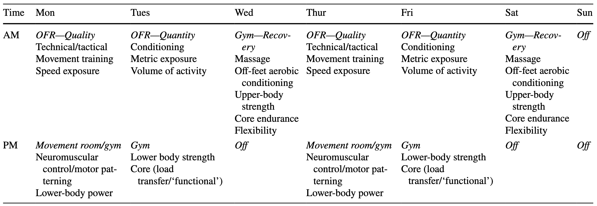

```{r setup-root, include=FALSE}
knitr::opts_knit$set(root.dir = normalizePath("../.."))
```

```{r}
source("Global.R")
source("plot_functions.R")
source("Themes.R")
```

The timing of an athlete's return to sport

::: {.callout-important title="Most Important Goals — Phase 3"}
- Excellent performance on dynamic tasks: all outcomes \>95% of pre-injury or opposite leg performance
- Demonstrate high level of comfort, confidence, and eagerness to return to sport
:::

**`r params$athlete`'s** progress

```{r}
#Create the table
tbl_phase4 <- criteria_phase4 %>%
  transmute(
    `Outcome Measure` = outcome_measure,
    `Op` = operator_pretty,
    Goal              = goal_pretty,   # nice display string from your sheet
    Score             = score,
    meets
  ) %>%
  gt() %>%
  tab_header(title = md("**Phase 4 Criteria**")) %>%
  fmt_number(
    columns = Score,
    decimals = 0
  ) %>%
  #   fmt_number(
  #   columns = Score,
  #   rows = `Outcome Measure` %in% c("Hamstring Strength", "Quad Strength"),
  #   decimals = 0,
  #   pattern = "{x}%"
  # ) %>%
  sub_missing(columns = Score, missing_text = "") %>%
  cols_label(Op = "") %>%
  cols_width(`Outcome Measure` ~ px(360)) %>%
  cols_align(align = "center", columns = c(Goal, Score)) %>%
  cols_align(align = "right",  columns = Op) %>%
  tab_style(
    style = list(cell_fill(color = "#E8F5E9"),
                 cell_text(color = "#1B5E20", weight = "600")),
    locations = cells_body(columns = Score, rows = meets %in% TRUE)
  ) %>%
  tab_style(
    style = list(cell_fill(color = "#FFF9C4"),
                 cell_text(color = "#7A6A00", weight = "600")),
    locations = cells_body(columns = Score, rows = meets %in% FALSE)
  )  %>%
  cols_hide(meets) %>%
  ak_gt_theme3() %>%
  tab_options(
    table_body.hlines.style = "solid",
    table_body.hlines.width = px(1),
    data_row.padding = px(6)
  )

tbl_phase4
```

```{r}

goals_progress_bar <- function(
    met, total,
    label = "Goals met",
    width = "100%",
    accent = "#D71920",   # table accent (red)
    border = "#A7A9AC",   # table border grey
    track_bg = "#FCFCFC", # header/stripe light bg
    fill_from = "#2E7D32",# green gradient start
    fill_to   = "#4CAF50" # green gradient end
) {
  pct <- if (total > 0) round(100 * met / total) else 0
  
  tagList(
    tags$style(HTML(sprintf("
      .ak-pb-wrap   { margin-top:12px; font-family:'Open Sans',system-ui,-apple-system,Segoe UI,Roboto,Arial,sans-serif; }
      .ak-pb-meta   { display:flex; justify-content:space-between; font-size:0.95rem; margin-bottom:6px; color:#222; }
      .ak-pb-meta strong{ color:%s; font-weight:700; } /* accent like table title */
      .ak-pb       { background:%s; border:1px solid %s; border-radius:10px; height:14px; overflow:hidden; }
      .ak-pb__fill { height:100%%; background:linear-gradient(90deg,%s,%s); transition:width .3s ease; }
    ", accent, track_bg, border, fill_from, fill_to))),
    div(class = "ak-pb-wrap",
        div(class = "ak-pb-meta",
            tags$strong(sprintf("%s: %d/%d", label, met, total)),
            span(sprintf("%d%%", pct))
        ),
        div(
          class = "ak-pb",
          role = "progressbar",
          `aria-valuemin` = "0",
          `aria-valuemax` = "100",
          `aria-valuenow` = pct,
          style = sprintf("width:%s;", width),
          div(class = "ak-pb__fill", style = sprintf("width:%d%%;", pct))
        )
    )
  )
}


# By default: denominator = all criteria (matches your table showing blank scores)
met_n_all   <- sum(criteria_phase4$meets %in% TRUE, na.rm = TRUE)
total_n_all <- nrow(criteria_phase4)

goals_progress_bar(met_n_all, total_n_all)

```

```{=html}
<div class="break-logo">
  
</div>
```

## What does the research say? {#preop-outcomes}

### Continued Progress of Neuromuscular performance

Criteria in this stage continue to progress the athlete towards high neuromuscular function on all tasks that is comparable to pre-injury values, the performance of the unaffected limb, and to normative or sport-relevant indicators.

The detailed criteria-based approach used in the protocol allows for comparison

### Sport Specific Retraining

::::: columns
::: {.column width="50%"}
The RTS process should include a progression from on-field rehabilitation to return to team training before eventually returning to competition, all of which is performed alongside sport-relevant physical re-conditioning @buckthorpe2019a. Previously, a four-stage "late rehabilitation" model has been proposed [@buckthorpe2019b] which is summarized in @fig-1. During late stage rehabilitation, gym based programming continues (blue circle), while the athlete begins a progression from on-field rehab (OFR) to return to training (RTT), return to competition (RTC) and finally return to performance (RTP). The model also highlights the transition from IST-led rehabilitation to performance team-led rehab and the importance of collaboration amongst all staff, particularly at this stage of rehab.

Using the context provided by this model, Phase 4 of the CSI Pacific ACL Guide will include OFR and RTT, and Phase 5 will provide further guidance related to RTC and RTP.
:::

::: {.column width="50%"}
![The transition from the rehabilitation phases to actual performance, including leadership and collaboration among medical and performance staff. OFR = On-field Rehabilitation, RTT = Return to Training, RTC = Return to Competitions, RTP = Return to Performance [@buckthorpe2019b].](images/rehab-to-performance.jpg){#fig-1 fig-align="right" width="635"}
:::
:::::

### On-field Rehabilitation (OFR)

Incorporating rehabilitation activities onto the field of play acts as a bridge to the return to usual training activities with coaches and teammates. For example, this may include controlled agility and change of direction drills performed on a field, or safe, controlled skiing on a freshly groomed gentle slope. Sport specific retraining at this stage incorporates re-training of sport specific movement, physical reconditioning, and the restoration of technical skills all of which are incorporated at a level in line with the health status of the athlete @buckthorpe2019a.

#### Field-based

sadsddsa

#### Snow-based

dafdafd

### Return to Training (RTT)

dassadasd

### Psychological Readiness to RTS

dsf

dsfsd

```{=html}
<div class="break-logo">
  
</div>
```

## Testing

Each card below contains a detailed description of the tests to be conducted during this phase of rehab.

```{r, echo=FALSE, results='asis'}


tests <- criteria_phase3 |>
  dplyr::select(outcome_measure, display_description, additional_information, operator_pretty, goal_pretty, repetitions, calculation, image_path) %>%
  mutate(op_goal = paste(operator_pretty, goal_pretty)) %>%
    filter(!outcome_measure %in% c(
    "Y-Balance (Anterior)",
    "Y-Balance (Postero-Medial)",
    "Y-Balance (Postero-Lateral)"
  ))

# Helper: print a label/value line only if value is non-missing & non-empty
emit_field <- function(label, value) {
  if (length(value) == 0 || all(is.na(value))) return(invisible())
  val <- value[[1]]
  if (is.na(val)) return(invisible())
  val_chr <- trimws(as.character(val))
  if (!nzchar(val_chr)) return(invisible())
  cat("**", label, ":** ", val_chr, "\n\n", sep = "")
}

for (i in seq_len(nrow(tests))) {

  cat('::: {.card .ak-card .has-stripe .accent-primary}\n')

  # ---- TITLE ----
  cat('### ', tests$outcome_measure[i], '\n\n', sep = '')

  # ---- FULL-WIDTH TEXT ----
  if (!is.na(tests$display_description[i]) &&
      nzchar(trimws(tests$display_description[i]))) {
    cat(tests$display_description[i], '\n\n')
  }

  cat("*", tests$additional_information[i], '\n\n')

# ---- BOTTOM ROW (FLEX) ----
cat('<div style="display:flex; gap:1.5rem; align-items:center;">\n')

# LEFT: CRITERIA BLOCK (slightly narrower)
cat('<div style="flex:0 0 35%;">\n')
emit_field("Criteria", tests$op_goal[i])
emit_field("Repetitions", tests$repetitions[i])
emit_field("Calculation", tests$calculation[i])
cat('</div>\n')

# RIGHT: IMAGE (wider + centered)
cat('<div style="flex:0 0 65%; text-align:center;">\n')
if (!is.na(tests$image_path[i]) && nzchar(trimws(tests$image_path[i]))) {
  cat('\n',
      sep = '')
}
cat('</div>\n')

cat('</div>\n')  # end flex row

  cat(':::\n\n')  # end card
}

```

```{=html}
<div class="break-logo">
  
</div>
```

## The Program

Below you will find links to your training programs.

[Phase 4: Program 1](https://www.teambuildr.com/)

When considering changes or further individualization of the program, see the lists below highlighting typically safe and unsafe exercises during this phase. To see how these exercises compare to other phases of the rehab, please see the **Exercise Phase Chart** in the book resources. All exercise programming should be done by a CSI Pacific S&C Coach or a physiotherapist.



Exercises and activities during this phase typically include

Peer-reviewed literature that was consulted in the making of pre-op programs is referenced here.

```{=html}
<div class="break-logo">
  
</div>
```

## Additional Resources

### Blood Flow Restriction

Although, blood flow restriction

Another more recent study

```{=html}
<div class="break-logo">
  
</div>
```

## Notes and Considerations for Reviewers

All feedback is welcome, however here are some considerations that should help inform the development of this tool.

- Please
