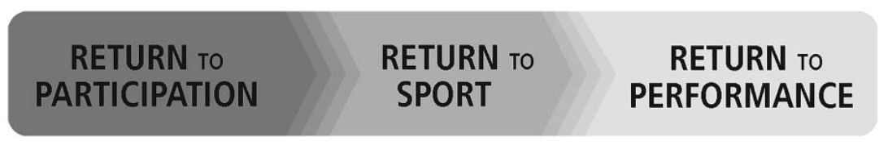
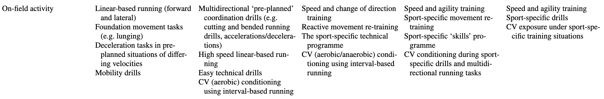
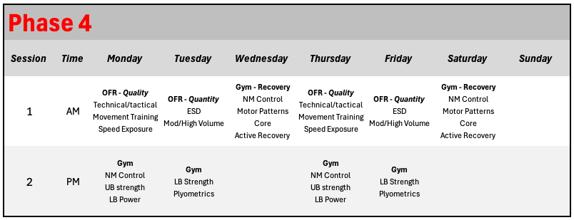

```{r setup-root, include=FALSE}
knitr::opts_knit$set(root.dir = normalizePath("../.."))
```

```{r}
source("Global.R")
source("plot_functions.R")
source("Themes.R")
```

As the athlete enters Phase 4 of ACL rehabilitation, they have established adequate levels of strength, power and movement quality demonstrated in controlled activities like lifting, jumping, landing, dynamic balance, agility and COD. Strength and neuromuscular control should be at or near pre-injury values while performance in dynamic tasks like jumping, landing, and COD should have reached a level where the intensity of these exercises can be progressed and can begin to resemble actions that occur in the athlete's sport. Strong attention to detail and intelligent, individualized programming during this phase will bring the athlete closer to pre-injury or opposite leg performance values on dynamic tests and will prepare them for sporting activities.

::: {.callout-important title="Most Important Goals — Phase 3" icon="false"}
- Excellent performance on dynamic tasks: all outcomes \>90% of pre-injury or opposite leg performance
- Demonstrate high level of comfort, confidence, and eagerness to return to sport
:::

**`r params$athlete`'s** progress towards these goals will be assessed via the criteria seen below.

```{r}
#Create the table
tbl_phase4 <- criteria_phase4_abr %>%
  transmute(
    `Outcome Measure` = outcome_measure,
    `Op` = operator_pretty,
    Goal              = goal_pretty,   # nice display string from your sheet
    Score             = score,
    meets
  ) %>%
  gt() %>%
  tab_header(title = md("**Phase 4 Criteria**")) %>%
  fmt_number(
    columns = Score,
    decimals = 0
  ) %>%
  fmt_number(
    columns = Score,
    rows = `Outcome Measure` %in% percent_label,
    decimals = 0,
    pattern = "{x}%"
    ) %>%
  sub_missing(columns = Score, missing_text = "") %>%
  cols_label(Op = "") %>%
  cols_width(`Outcome Measure` ~ px(360)) %>%
  cols_align(align = "center", columns = c(Goal, Score)) %>%
  cols_align(align = "right",  columns = Op) %>%
  tab_style(
    style = list(cell_fill(color = "#E8F5E9"),
                 cell_text(color = "#1B5E20", weight = "600")),
    locations = cells_body(columns = Score, rows = meets %in% TRUE)
  ) %>%
  tab_style(
    style = list(cell_fill(color = "#FFF9C4"),
                 cell_text(color = "#7A6A00", weight = "600")),
    locations = cells_body(columns = Score, rows = meets %in% FALSE)
  )  %>%
  cols_hide(meets) %>%
  ak_gt_theme3() %>%
  tab_options(
    table_body.hlines.style = "solid",
    table_body.hlines.width = px(1),
    data_row.padding = px(6)
  )

tbl_phase4
```

```{r}

goals_progress_bar <- function(
    met, total,
    label = "Goals met",
    width = "100%",
    accent = "#D71920",   # table accent (red)
    border = "#A7A9AC",   # table border grey
    track_bg = "#FCFCFC", # header/stripe light bg
    fill_from = "#2E7D32",# green gradient start
    fill_to   = "#4CAF50" # green gradient end
) {
  pct <- if (total > 0) round(100 * met / total) else 0
  
  tagList(
    tags$style(HTML(sprintf("
      .ak-pb-wrap   { margin-top:12px; font-family:'Open Sans',system-ui,-apple-system,Segoe UI,Roboto,Arial,sans-serif; }
      .ak-pb-meta   { display:flex; justify-content:space-between; font-size:0.95rem; margin-bottom:6px; color:#222; }
      .ak-pb-meta strong{ color:%s; font-weight:700; } /* accent like table title */
      .ak-pb       { background:%s; border:1px solid %s; border-radius:10px; height:14px; overflow:hidden; }
      .ak-pb__fill { height:100%%; background:linear-gradient(90deg,%s,%s); transition:width .3s ease; }
    ", accent, track_bg, border, fill_from, fill_to))),
    div(class = "ak-pb-wrap",
        div(class = "ak-pb-meta",
            tags$strong(sprintf("%s: %d/%d", label, met, total)),
            span(sprintf("%d%%", pct))
        ),
        div(
          class = "ak-pb",
          role = "progressbar",
          `aria-valuemin` = "0",
          `aria-valuemax` = "100",
          `aria-valuenow` = pct,
          style = sprintf("width:%s;", width),
          div(class = "ak-pb__fill", style = sprintf("width:%d%%;", pct))
        )
    )
  )
}


# By default: denominator = all criteria (matches your table showing blank scores)
met_n_all   <- sum(criteria_phase4_abr$meets %in% TRUE, na.rm = TRUE)
total_n_all <- nrow(criteria_phase4_abr)

goals_progress_bar(met_n_all, total_n_all)

```

```{=html}
<div class="break-logo">
  
</div>
```

## What does the research say? {#preop-outcomes}

Firstly, it is important to define what is meant by RTS and to differentiate between 1) return to participation; 2) RTS which is the objective at the end of Phase 4; and 3) RTP which is the objective of Phase 5. The following definitions are taken from the 2016 consensus statement published by Ardern et al @ardern2016 and make up the RTS continuum shown in @fig-1.

{#fig-1 .lightbox}

::: {.callout-important appearance="minimal" icon="false"}

Return to Participation

:   The athlete may be participating in on-field rehabilitation and may be training their sport, but at a level lower than his or her RTS goal.

Return to Sport (RTS)

:   The athlete has returned to his or her defined sport, but is not performing at his or her desired performance level.

Return to Performance (RTP)

:   The athlete has gradually returned to his or her defined sport and is performing at or above his or her pre-injury level.
:::

There is a general consensus among experts regarding the selection of criteria for a RTS decision, however the level of certainty regarding these criteria is low @kotsifaki2023a. A recent systematic review found only four studies examining criteria-based RTS and reported that current criteria may be suboptimal at reducing the risk of re-injury @losciale2019. It is important to acknowledge that injuries are an inherent risk of sport participation and cannot be eliminated entirely, however this lack of certainty does not take away from the need for criteria-based decision making. In support of this, one study found that athletes who did not meet all RTS criteria before returning to professional sport had a four times greater risk of sustaining an ACL graft rupture compared with those who met all criteria @kyritsis2016. In another, out of 106 athletes in a prospective 2-year cohort study, 38.2% of those who failed RTS criteria suffered re-injuries versus only 5.6% of those who passed the criteria @grindem2016.

In our opinion the lack of certainty in ACL RTS criteria in the published literature is likely due in large part to the multi-factorial nature of injury research, making it difficult to control all factors (e.g. the quality of the day-to-day rehabilitation). Another recent systematic review/ meta-analysis reported that across 49 studies and 4463 knees, more than 85% of elite and professional athletes returned to play @dambrosi2025. The high levels of RTP reported in this review likely reflect the high quality of rehabilitation that would be delivered to elite athletes, above and beyond what the general public might have access to. In practice, by delivering a high-quality rehabilitation, and relying on robust criteria supported by expert consensus, the athlete will be given the best chance to achieve a successful RTS and eventual RTP. As the athlete works towards achieving Phase 4 criteria, rehabilitation will focus on continued progression of neuromuscular performance in the gym, with increased focus on explosive/ballistic strength and high-intensity plyometrics. Additionally, an RTS continuum will be applied to guide the implementation of on-field rehabilitation (OFR) and a return to training (RTT), in order to best prepare the athlete for a successful RTS.

### Continued Progress of Neuromuscular performance

During Phases 2 and 3, a large focus has been made on developing neuromuscular strength and control, and the athlete has been introduced to more dynamic activities like running, jumping and landing. At this point the athlete has regained quadriceps and hamstring isometric strength (\> 90% of opposite limb), should be able to TrapBar deadlift more than 1.8x body mass, and has demonstrated adequate SL strength and endurance in the SL squat. Additionally, the athlete has demonstrated the ability to perform dynamic tasks like jumping, hopping and landing, and has achieved performance outcomes on these tasks that demonstrates their preparedness to continue with more explosive neuromuscular training. This type of training is necessary prior to RTS, given that the ability to produce force rapidly is important for the re-stabilization of joints following mechanical perturbation and in sporting tasks such as sprint running and jumping @buckthorpe2019a. The ability to produce force quickly is often assessed via rate of force development (RFD) which may be more relevant to how forces are produced during sport @buckthorpe2018, and therefore deserves increased attention as the athlete draws closer to RTS.

On this topic, one study reported RFD deficits of 30% at 6 months post-ACLR despite 97% restoration of maximal concentric quadriceps strength @angelozzi2012. Critically, RFD was restored at 12 months following implementation of a power development program, highlighting the need to train explosive neuromuscular performance in addition to maximal strength. In order to train RFD, particularly sub-150ms where RFD is not influenced by maximal muscle strength @folland2014, specific stimuli are required including explosive strength training @tillin2012, ballistic strength training @mangine2016 and plyometrics. These stimuli are achieved within the program via exercises including jumping, hopping, Olympic lifting (including derivatives), loaded jumps and medicine ball training.

::: {.callout-important appearance="minimal" icon="false"}

Explosive Strength

:   The capacity to generate high levels of force in the very early stages of muscular contraction (\~50-150ms) against load, without assistance from the stretch-shortening cycle @james2023.

Ballistic Strength

:   The [capacity](https://www.scienceforsport.com/ballistic-training/) to maximize acceleration through a full range of motion, resulting in projection of the body or an external object into a flight phase.

Plyometrics

:   Explosive movement involving a rapid eccentric pre-stretch followed immediately by a concentric contraction, in which power output is enhanced through the storage and release of elastic potential energy @markovic2010.
:::

While each of these components will be addressed in training, not every aspect is directly measured and reflected in the criteria. For example, it is important to note that the CSI Pacific ACL protocol does not currently report RFD directly in any OKC or CKC tasks, due to well established difficulties evaluating RFD in a valid and reliable way @maffiuletti2016.

### Plyometrics

In Phase 3 we discussed stages 2 and 3 of the [plyometric progressions](#fig-2) published by Buckthorpe & Della Villa @buckthorpe2021a. Stage 4 of that framework aligns well with the Phase 4 objectives of this protocol, with the goal being to optimize lower limb explosive neuromuscular performance and support sport-specific movement retraining in preparation for RTS.

{#fig-2 .lightbox}

Provided that the athlete has tolerated stage 2 and 3 plyometric activities well, at this time they may progress to higher intensity exercises such as maximal unilateral plyometrics, multiplanar unilateral movements (e.g. frontal and rotational plane) and reactive field-based movements (e.g. responding to perturbations; unplanned tasks). As will be seen in the next section, these activities may take place in the gym or in field-based situations.

### The RTS Continuum

::::: columns
::: {.column width="50%"}
As the athlete continues to make progress on gym-based rehabilitation, and draws closer to RTS, a gradual shift away from rehab and towards performance will occur. While at the end of Phase 4, it is expected that the athlete will return to playing their sport, this is not something that happens on one specific day. It is a continuum that should include a progression from on-field rehabilitation to return to team training before eventually returning to competition, all of which is performed alongside sport-relevant physical re-conditioning @buckthorpe2019a.

Previously, a four-stage "late rehabilitation" model has been proposed [@buckthorpe2019b] which is summarized in @fig-3. During late stage rehabilitation, gym based programming continues (blue circle), while the athlete begins a progression from on-field rehab (OFR) to return to training (RTT), return to competition (RTC) and finally return to performance (RTP). The model also highlights the transition from IST-led rehabilitation to performance team-led rehab and the importance of collaboration amongst all staff, particularly at this stage of rehab. Using the context provided by this model, Phase 4 of the CSI Pacific ACL Guide will focus on OFR and RTT, and Phase 5 will provide further guidance related to RTC and RTP.
:::

::: {.column width="50%"}
![The transition from the rehabilitation phases to actual performance, including leadership and collaboration among medical and performance staff. OFR = On-field Rehabilitation, RTT = Return to Training, RTC = Return to Competitions, RTP = Return to Performance [@buckthorpe2019b].](images/rehab-to-performance.jpg){#fig-3 .lightbox fig-align="center" width="405"}
:::
:::::

### On-field Rehabilitation (OFR)

Incorporating rehabilitation activities onto the field of play acts as a bridge to the return to usual training activities with coaches and teammates. It has been suggested that completing a greater proportion of functional recovery from serious knee injury on the field may be associated with superior RTS outcomes @dellavilla2012 and lower re-injury risk upon RTS @kyritsis2016. Sport specific retraining at this stage incorporates re-training of sport specific movement, physical reconditioning, and the restoration of technical skills all of which are incorporated at a level in line with the health status of the athlete @buckthorpe2019a. For example, this may include controlled agility and change of direction drills performed on a field, or safe, controlled skiing on a freshly groomed gentle slope.

### Return to Training (RTT)

During RTT, workload monitoring is key to understanding progression and to the eventual decision to RTS. It is likely that inappropriate loading can contribute to injury risk during this phase, and also in the future if the athlete fails to develop sufficient chronic training loads @blanch2016. This becomes a delicate balance where over-training may compromise the rehab in the short term but under-training may fail to adequately prepare the athlete for the demands of returning to play.

+------------------+-----------------------------------------------------------------------+--------------------------------------------------+
| Sport            | On-field Rehabilitation                                               | Return to Training                               |
+==================+=======================================================================+==================================================+
| Soccer, Rugby    | Planned and controlled agility and COD drills performed on the pitch. | Reactive drills                                  |
|                  |                                                                       |                                                  |
|                  |                                                                       | Casual games                                     |
+------------------+-----------------------------------------------------------------------+--------------------------------------------------+
| Hockey           | Light skating                                                         | Reactive drills                                  |
|                  |                                                                       |                                                  |
|                  | Controlled accel/deccel/COD                                           | Scrimmage with no contact jersey                 |
+------------------+-----------------------------------------------------------------------+--------------------------------------------------+
| Alpine Skiing    | Controlled skiing on a freshly groomed slope                          | Faster, more aggressive skiing                   |
|                  |                                                                       |                                                  |
|                  | Ski simulator                                                         | Variable terrain                                 |
|                  |                                                                       |                                                  |
|                  |                                                                       | Skiing on course with gates                      |
+------------------+-----------------------------------------------------------------------+--------------------------------------------------+
| Freestyle Skiing | Controlled skiing on a freshly groomed slope                          | Progressive introduction of jumps, moguls, rails |
|                  |                                                                       |                                                  |
|                  | Ski simulator                                                         |                                                  |
+------------------+-----------------------------------------------------------------------+--------------------------------------------------+

The CSI Pacific RTP protocol seeks to mitigate this risk by providing the optimal tools for collecting and understanding both internal and external workload. Continued testing of Phase 4 and 5 criteria in addition to daily wellness monitoring will ensure that the rehabilitation is not being compromised by increased workloads and intensities. Meanwhile, external load monitoring is more specific to the sport, and ideally is driven by the performance staff, however this protocol does provide some generic tools for assessing external workload in both field and snow sports.

#### Field-based Sports

Monitoring of external load using GPS for team sport athletes is recommended when available, however exact loads and strategies associated with the RTS process are not currently known @buckthorpe2019a.

Use the 2 part Buckthorpe papers

#### Snow-based Sports

Might as well write about the consensus statement paper

### Psychological Readiness to RTS

Psychological readiness is an independent and critical determinant of RTS outcomes following ACLR, and must be addressed with the same rigour applied to physical criteria @lo2025. Athletes with lower psychological readiness are less likely to return to their pre-injury level of sport, often reporting fear of re-injury and kinesiophobia that delay or prevent successful RTS even in the absence of obvious physical impairment.

The ACL Return to Sport after Injury scale (ACL-RSI) which covers emotions, confidence in performance, and risk appraisal @webster2008 is the recommended tool for serial assessment of psychological readiness. Normative ACL-RSI data from a large meta-analysis demonstrate that psychological readiness scores tend to improve meaningfully in the early post-operative period but then plateau and remain relatively stable until two to five years post-surgery @sell2024. The implications of this are a need for proactive psychological monitoring throughout the rehab and particularly during the RTS period, which is often between 6-12 months post-ACLR. It's unclear if their exists any validated ACL-RSI score that musty be achieved prior to RTS. The current protocol allows for easy collection and comparison/tracking relative to the athlete's own longitudinal profile. Additionally, practitioners should document specific ACL-RSI item-level deficits to guide intervention selection rather than responding to total scores alone.

The Tampa Scale of Kinesiophobia (TSK-11), examining pain-related fear, fear of movement, and/or fear of injury should be used in conjunction with the ACL-RSI @butler2025. Patients with high kinesiophobia (TSK-11 scores ≥ 19) at the time of RTS are 13 times more likely to suffer a graft rupture within 20 years of RTS compared to those with lower kinesiophobia @paterno2018. Where screening identifies psychological insufficiency, targeted interventions including imagery training, knee bracing during progressive loading, and kinesiotaping can improve both psychological and functional outcomes.

```{=html}
<div class="break-logo">
  
</div>
```

## Testing

Each card below contains a detailed description of the tests to be conducted during this phase of rehab.

```{r, echo=FALSE, results='asis'}


tests <- criteria_phase4 |>
  dplyr::select(outcome_measure, display_description, additional_information, operator_pretty, goal_pretty, repetitions, calculation, image_path) %>%
  mutate(op_goal = paste(operator_pretty, goal_pretty)) %>%
    filter(!outcome_measure %in% c(
      "CMJ Lengthening Asymmetry",
      "CMJ Shortening Asymmetry"
  ))

# Helper: print a label/value line only if value is non-missing & non-empty
emit_field <- function(label, value) {
  if (length(value) == 0 || all(is.na(value))) return(invisible())
  val <- value[[1]]
  if (is.na(val)) return(invisible())
  val_chr <- trimws(as.character(val))
  if (!nzchar(val_chr)) return(invisible())
  cat("**", label, ":** ", val_chr, "\n\n", sep = "")
}

for (i in seq_len(nrow(tests))) {

  cat('::: {.card .ak-card .has-stripe .accent-primary}\n')

  # ---- TITLE ----
  cat('### ', tests$outcome_measure[i], '\n\n', sep = '')

  # ---- FULL-WIDTH TEXT ----
  if (!is.na(tests$display_description[i]) &&
      nzchar(trimws(tests$display_description[i]))) {
    cat(tests$display_description[i], '\n\n')
  }

  cat("*", tests$additional_information[i], '\n\n')

# ---- BOTTOM ROW (FLEX) ----
cat('<div style="display:flex; gap:1.5rem; align-items:center;">\n')

# LEFT: CRITERIA BLOCK (slightly narrower)
cat('<div style="flex:0 0 35%;">\n')
emit_field("Criteria", tests$op_goal[i])
emit_field("Repetitions", tests$repetitions[i])
emit_field("Calculation", tests$calculation[i])
cat('</div>\n')

# RIGHT: IMAGE (wider + centered)
cat('<div style="flex:0 0 65%; text-align:center;">\n')
if (!is.na(tests$image_path[i]) && nzchar(trimws(tests$image_path[i]))) {
  cat('\n',
      sep = '')
}
cat('</div>\n')

cat('</div>\n')  # end flex row

  cat(':::\n\n')  # end card
}

```

```{=html}
<div class="break-logo">
  
</div>
```

## The Program

Below you will find links to your training programs.

[Phase 4: Program 1](https://www.teambuildr.com/)

@fig-4 provides a five stage framework for progression of OFR and RTT @buckthorpe2019a.

{#fig-4 .lightbox}

@fig-5 shows an example weekly training schedule incorporating OFR into Phase 4 ACL rehabilitation. A big change from Phase 3 is that OFR sessions may occur before gym sessions on a given day, reflecting the priority of the sessions and ensuring that OFR training does not take place in the presence of acute fatigue. Another major difference is that workouts are no longer characterized as ACLR vs Non-ACLR; rather the programming more closely resembles a non-rehab performance program. Monday and Thursday gym sessions focus on activities that will not cause a lot of neuromuscular fatigue, allowing the athlete to train on back-to-back days. Tuesday and Friday sessions incorporate more volume in the OFR and more targeted intensity in the gym, including potentially provocative exercises like plyometrics. Wednesday and Saturday sessions account for this by focusing on less demanding exercises and prioritizing recovery.

{#fig-5 .lightbox fig-align="left"}

```{=html}
<div class="break-logo">
  
</div>
```
